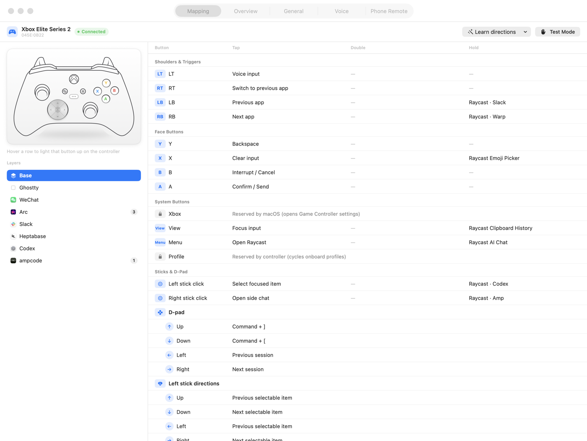
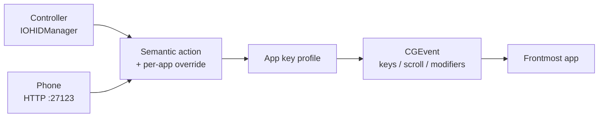

<div align="center">


# JoyCoding

**Turn a game controller — or your phone — into a coding remote for macOS.**

[中文](README.zh-CN.md) · English

</div>

---

Talk to your AI coding agent instead of typing. Approve, interrupt, scroll and
switch sessions from a Joy-Con in one hand, while the other stays on the mouse.
Or leave the controller in a drawer and use your phone.

<div align="center">

</div>

## Why

Working with an agent is mostly a loop of **read → say something → approve → interrupt**.
None of that needs a keyboard. JoyCoding maps that loop onto a controller:

- **Hold a trigger and speak** — push-to-talk into any dictation tool
- **One button to send**, one to interrupt, one to scroll
- **The same button means the right thing in every app** — `Y` is backspace in
  your editor and *back* in Chrome, because a browser has no text to delete

## Features

- Works with **any HID gamepad** — Joy-Con (L/R), Switch Pro, PlayStation, and more
- **Two independent layers of per-app behaviour** (see below)
- **Tap / double-tap / long-press** on every button
- **Push-to-talk** that preserves sided shortcut chords (including Right Shift + Return)
- **Phone remote** over your LAN — pair once with a 6-digit code
- **Battery level** for Nintendo controllers (macOS does not expose this; see [docs](docs/battery.md))
- Live button highlighting while you map, so you never guess a button number
- **Test Mode** highlights physical input and resolves its binding without firing any action
- **Key profiles for 10 apps out of the box** — Claude Code, ChatGPT, Cursor,
  VS Code, Ghostty, iTerm2, Terminal, Chrome, Arc, WeChat
- Ships with sensible defaults — plug in a controller and it just works

## Two layers, and why

Button bindings stay **purely semantic**. You bind `A` to *Confirm / Send*, never
to a keystroke. What keystroke that becomes is decided separately:

```
Button mapping     A = Confirm / Send          ← semantic, never changes
                        ↓
App key profile    Claude Code : ⌃⇥            ← only this layer knows shortcuts
                   ChatGPT     : ⇧⎋
                   Chrome      : ⌃⇥
```

That split matters because **most people do not know their app's shortcuts** —
ChatGPT focuses its composer with `⇧⎋`, something Claude Code has no shortcut
for at all. So JoyCoding ships profiles for common apps, and you can record any
shortcut yourself from **Overview → click an app column**.

On top of that, a button can be **overridden per app**: `Y` is backspace
everywhere, but *Back* in Chrome, because a browser has no text to delete.

<p align="center">

</p>
<p align="center"><sub>
<b>Overview</b> lays the two layers side by side: the semantic action on the left,
what each app turns it into across the columns. Greyed <code>↳</code> means
"inherits the base layer"; bold means this app overrides it.
</sub></p>

<p align="center">

</p>
<p align="center"><sub>
Click a column header to edit that app's profile. <b>Record</b> captures a real
keystroke; leaving a row empty means the app has no such shortcut and the button
stays inert there.
</sub></p>

## Supported controllers

| Controller | Buttons | Notes |
|---|---|---|
| Xbox Wireless / Elite | Model-specific + LT/RT | Product-specific Bluetooth normalization; physically verified with Elite 2 `045E:0B22` |
| Joy-Con (L) / (R) | 11 | Stick direction must be learned once — it rotates 90° depending on grip |
| Switch Pro | 13 | macOS claims the Home button for its game overlay |
| PlayStation | 14–15 | Artwork and defaults ready; button numbering unverified |
| Any other HID gamepad | — | Mapping works; no illustration |

See the [physical Xbox Bluetooth proof](docs/xbox-proof.md) for the raw HID →
normalized input → semantic action traces.

### Xbox layout in this fork

The default Xbox profile keeps the core editing taps and replays the exact
global shortcuts already assigned in Raycast. JoyCoding reads Raycast's newest
local cloud-sync snapshot at launch and never writes Raycast settings:

| Control | Tap | Hold / app-specific |
|---|---|---|
| LT | Raycast Dictation PTT | Follows Raycast's current Dictation shortcut |
| RT | Previous app | — |
| LB | Confirm / send | Raycast → Slack |
| RB | Raycast → Arc | Raycast → Warp |
| L3 | Cancel | Raycast → Codex |
| R3 | Side chat | Raycast → Amp |
| View | Focus input | Raycast Clipboard History |
| Menu | Open Raycast | Raycast AI Chat |
| Elite Profile | Hardware-only: cycles the controller's onboard profile | — |
| D-pad / left stick | Scroll up/down; previous/next session | — |
| Right stick | Arrow keys | — |
| X | Clear input (Reload in Arc) | Raycast Emoji Picker |
| Y | Backspace (Back in Arc) | — |

The local-settings assertions, Raycast screenshots, and exact event sequence are included in the
[Xbox proof](docs/xbox-proof.md#raycast-dictation-hold-lt-to-speak).

## Install

**Download** the notarized build from [Releases](../../releases) — unzip, drag to
Applications, open.

Requires **macOS 13 or later**. The build is a universal binary, so it runs
natively on both Apple Silicon and Intel Macs.

**Or build it yourself** (needs Xcode command line tools):

```bash
git clone https://github.com/alizeeblack-code/joycoding.git
cd joycoding && ./build.sh --no-notarize
```

## Getting started

1. Open JoyCoding. Grant **Accessibility** in System Settings when asked, then
   hit **Restart JoyCoding** in the app — macOS does not apply the grant to a
   running process.
2. Pair a controller over Bluetooth. Default mappings are applied automatically.
3. For a Joy-Con, run **Learn stick directions** once, holding it the way you
   normally do.

## Phone remote

<div align="center">

&nbsp;&nbsp;&nbsp;

</div>

Open **Settings → Phone Remote**, scan the QR code or type the 6-digit code once.
The URL is just `http://<your-mac>:27123/` — the real token lives in a cookie
afterwards. Add it to your Home Screen and it runs full screen.

The four corners are direct app switches with real app icons; the function row
changes with whatever app is in front.

> ⚠️ This endpoint can synthesize keystrokes. Use it on a trusted LAN or
> Tailscale only — never port-forward it.

## How it works



One action table serves both inputs, so adding an action makes it available to
the controller and the phone at once. No app-specific keystroke is hardcoded —
they all live in editable profiles, which is what makes adding a new app a
matter of filling in a table rather than changing code.

## Known limits

- **Home / PS / Xbox button** is captured by macOS for its game overlay. Nothing an app
  can do short of seizing the device exclusively, which would break games.
- **Joy-Con stick direction** must be learned — the HID hat switch is defined for
  sideways play, so holding it upright rotates every direction by 90°.
- **Mac App Store is not an option.** The app needs Accessibility and raw HID
  access; the sandbox forbids both.
- Web-based apps expose nothing to the Accessibility API, so "focus the input
  box" is a positional click, not a real focus call.

## Credits

This project stands on work by others:

- **[JoyType](https://github.com/0xDarcyJ/JoyType)** — its comments pointed out
  the two things that made battery reading work: the output report must be
  padded to 49 bytes, and the report ID has to stay in byte 0 of the buffer even
  though `IOHIDDeviceSetReport` takes it separately. Without that I had written
  the feature off as impossible.
- **Linux kernel `hid-nintendo.c`** — button bit order of the `0x30` full input report.
- **[JoyKeyMapper](https://github.com/magicien/JoyKeyMapper)** and
  **[JoyConSwift](https://github.com/magicien/JoyConSwift)** by magicien — where
  this idea started.
- **[Hammerspoon](https://www.hammerspoon.org)** — the entire thing ran as a
  Lua prototype there first.
- **Apple TV Remote** and **Google TV Remote** — design reference for the phone UI.

## License

MIT — see [LICENSE](LICENSE).

Nintendo, Switch, Joy-Con and PlayStation are trademarks of their respective
owners. This project is not affiliated with, endorsed by, or connected to any of
them.
