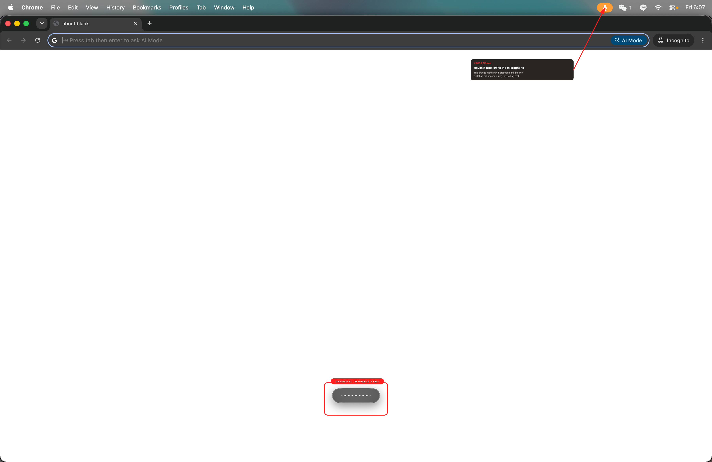
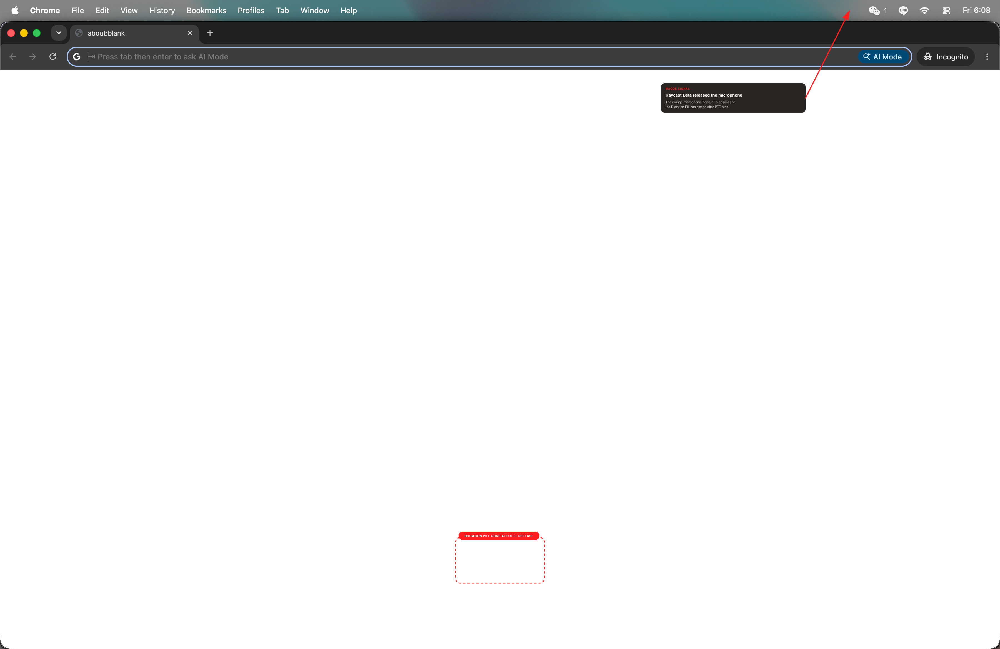

# Xbox Elite Series 2 controller proof

This is a physical-device smoke test, not a fixture. It was captured on
2026-08-21 from the signed `build/JoyCoding.app` on macOS 26.3 using the Xbox
Wireless Controller that was connected over Bluetooth at test time.

## Device identity

Both macOS Bluetooth inventory and a direct `IOHIDManager` probe reported one
physical gamepad:

```text
Xbox Wireless Controller (reported name)
transport=Bluetooth Low Energy
vendor=0x045E product=0x0B22
virtual=no
```

PID `0B22` and the controller's 15-button BLE report descriptor identify this
device as an Xbox Elite Series 2. JoyCoding now shows that product-specific name
instead of trusting the generic Bluetooth name.

The app then reported the same device ID, with the built-in Xbox profile seeded:

```json
{"deviceID":"045E:0B22","event":"device","mappedButtons":13,"mappedDirections":4,"name":"Xbox Elite Series 2","productID":2850,"vendorID":1118}
```

## Elite Series 2 Bluetooth button order

The original fork treated `0B22` like a standard Xbox Series controller. A live
dry-run capture of the physical sequence `A, B, X, Y, LB, RB, View, Menu,
Profile` disproved that assumption. The Button-page down events were:

```text
physical A       -> raw usage 1
physical B       -> raw usage 2
physical X       -> raw usage 4
physical Y       -> raw usage 5
physical LB      -> raw usage 7
physical RB      -> raw usage 8
physical View    -> no handled event in the original build
physical Menu    -> raw usage 11
physical Profile -> raw usage 12
```

The controller's locally read report descriptor exposes View separately as
Consumer usage `0xB2`; the original input path ignored that page. The gaps are
real fields in the Elite BLE descriptor, not missing button presses. The fix
normalizes those raw usages at the input boundary:

```text
raw 1 -> A (1)       raw 2 -> B (2)
raw 4 -> X (3)       raw 5 -> Y (4)
raw 7 -> LB (5)      raw 8 -> RB (6)
0x0C:0xB2 -> View (7)
raw 11 -> Menu (8)   raw 12 -> Profile (12)
raw 13 -> Xbox (11)  raw 14 -> L3 (9)  raw 15 -> R3 (10)
```

This keeps every stored action on JoyCoding's conventional Xbox IDs. It also
prevents unused raw usages 3, 6, 9, and 10 from masquerading as real controls.
The automated suite asserts the full table, the Elite-specific artwork, and the
unchanged behavior of non-Elite controllers.

## Physical input to JoyCoding action

The trace was recorded with `JOYCODING_PROOF_DRY_RUN=1`. That flag suppresses
only the final `CGEvent` output so the smoke test cannot operate another app.
Device discovery, HID normalization, profile lookup, gesture handling, and
semantic action resolution all run through the production code path.

The following are consecutive stages from the captured JSONL trace (timestamps
omitted here for readability).

### A button

```json
{"usagePage":9,"usage":1,"value":1,"event":"rawInput"}
{"button":1,"down":true,"deviceID":"045E:0B22","event":"button"}
{"button":1,"action":"confirm","deviceID":"045E:0B22","event":"binding"}
{"action":"confirm","event":"action"}
```

### LT and RT analog triggers

LT is HID Simulation usage `0xC5` (197); RT is `0xC4` (196). They become virtual
buttons 20 and 21 with hysteresis. The 10% press threshold also works when an
Elite trigger stop limits travel.

```json
{"usagePage":2,"usage":197,"value":340,"logicalMax":1023,"event":"rawInput"}
{"button":20,"down":true,"deviceID":"045E:0B22","event":"button"}
{"button":20,"action":"ptt","deviceID":"045E:0B22","event":"binding"}
{"action":"pttStart","event":"action"}
{"usagePage":2,"usage":197,"value":40,"logicalMax":1023,"event":"rawInput"}
{"button":20,"down":false,"deviceID":"045E:0B22","event":"button"}
{"action":"pttStop","event":"action"}

{"usagePage":2,"usage":196,"value":284,"logicalMax":1023,"event":"rawInput"}
{"button":21,"down":true,"deviceID":"045E:0B22","event":"button"}
{"button":21,"action":"switchApp","deviceID":"045E:0B22","event":"binding"}
{"usagePage":2,"usage":196,"value":0,"logicalMax":1023,"event":"rawInput"}
{"button":21,"down":false,"deviceID":"045E:0B22","event":"button"}
{"action":"switchApp","event":"action"}
```

### Bluetooth D-pad

The controller declares a one-based hat range (`1...8`) and reports `0` when
centred. JoyCoding now normalizes it to its existing zero-based clockwise form.

```json
{"usagePage":1,"usage":57,"value":1,"logicalMin":1,"logicalMax":8,"event":"rawInput"}
{"direction":0,"channel":"hat","deviceID":"045E:0B22","event":"hat"}
{"action":"scrollUp","event":"action"}

{"usagePage":1,"usage":57,"value":5,"logicalMin":1,"logicalMax":8,"event":"rawInput"}
{"direction":4,"channel":"hat","deviceID":"045E:0B22","event":"hat"}
{"action":"scrollDown","event":"action"}

{"usagePage":1,"usage":57,"value":7,"logicalMin":1,"logicalMax":8,"event":"rawInput"}
{"direction":6,"channel":"hat","deviceID":"045E:0B22","event":"hat"}
{"action":"sessionPrev","event":"action"}
```

## Raycast Dictation: hold LT to speak

This fork follows the exact Dictation binding stored by Raycast on the test Mac:

```text
Raycast command: c:r:dictation::-::dictateText
Raycast shortcut: Right Shift + Return (virtual key code 36)
JoyCoding mode: hold
```

This was read without opening or editing Raycast from its local snapshot at
`~/Library/Application Support/com.raycast.macos/cloud-sync/settings-snapshots/`.
The encrypted/custom `.db` files were not modified. JoyCoding therefore emits
the sided modifier as a real key-code 60
`flagsChanged` event, followed by Return key-code 36. The right-side flag is
preserved in addition to the ordinary Shift flag; emitting only generic Shift
does not match this Raycast shortcut.

The event-plan test asserts this exact sequence in both directions:

```text
LT down:  flagsChanged(keyCode=60, RightShift) -> keyDown(keyCode=36, RightShift)
LT up:    keyUp(keyCode=36, RightShift) -> flagsChanged(keyCode=60, none)
```

The physical trace above proves that Xbox LT (`usage 197`) resolves to
`pttStart` and `pttStop`. The screenshot pair below separately exercises those
same two `Actions` entry points through JoyCoding's authenticated localhost
remote. Splitting the proof this way makes the Raycast boundary repeatable
without claiming that the screenshot itself was triggered by a controller
press.

## Raycast shortcut layer

The same read-only snapshot contained the global hotkeys used by the Xbox
profile. An opt-in integration test loaded the actual file on this Mac—not a
fixture—and asserted all nine bindings:

```text
Open Raycast       ⌘ Space       Arc        ⌥ A
Raycast AI Chat    ⌥ Space       Slack      ⌥ S
Dictation          Right⇧ Return Codex      ⌥ C
Heptabase          ⌥ E           Amp        ⌥ X
Warp               ⌥ W
```

The production action path retains Raycast's macOS virtual key code and emits a
complete physical modifier-down, key-down, key-up, modifier-up chord. Therefore
the controller invokes the same global shortcut Raycast already owns; it does
not launch apps through a separate implementation or rewrite Raycast's
preferences.

Run the machine-specific assertion with:

```bash
JOYCODING_VERIFY_LOCAL_RAYCAST=1 swift test \
  --filter HIDNormalizationTests/testCurrentMacRaycastBindingsWhenExplicitlyRequested
```

On the test Mac this executed 1 test with 0 failures. The ordinary portable
suite separately checks the JSON parser and exact synthesized chord plan using
a fixture.

The installed signed app was also exercised through its authenticated local
action endpoint. The front app started as Slack. JoyCoding ran
`raycastAmp`, Raycast handled its existing `⌥X` global hotkey, and macOS then
reported Amp as frontmost. The same path ran `raycastSlack` (`⌥S`) to restore
the original app:

```text
JoyCoding: ok: raycastAmp
macOS front app: com.hamishbultitude.ampcode (Amp)
JoyCoding: ok: raycastSlack
macOS front app: com.tinyspeck.slackmacgap (Slack)
```

This canary proves the emitted shortcuts were accepted by Raycast and resolved
to their assigned applications. It did not edit Raycast settings.

### While PTT is held

The unedited raw capture shows two independent system/UI signals: Raycast's
orange microphone indicator in the menu bar and its live Dictation Pill near
the bottom of the screen.



- [Raw held PNG](images/proof/raycast-dictation-held-raw.png) — SHA-256
  `8d73db2a3f06643ab34943cbf0dedce84768cf79f001b181ff83e0167cdf8bed`
- Annotated held JPEG — SHA-256
  `b424be27b09d109c6ca5c396841c4b50f64b431b8815c9a95eb39e96b6525b00`

### After PTT is released

Four seconds after `pttStop`, both the orange microphone indicator and the
Dictation Pill are absent.



- [Raw released PNG](images/proof/raycast-dictation-released-raw.png) — SHA-256
  `39fbf54700f119e6a8b472b30133f02e0780039e59a8a9687cd7ad261a553458`
- Annotated released JPEG — SHA-256
  `1a113679f8718da790c331a42f15e56018c27d7e363b5953b2a2148b54109ea9`

Both raw and annotated captures are `3600 x 2338`. The annotations are
deterministic SVG/Sharp overlays described by the adjacent JSON specs; the raw
pixels and hashes remain untouched.

## Actual macOS event delivery

The physical traces above used dry-run mode to prevent accidental input in an
uncontrolled frontmost app. The final `CGEvent` boundary was tested separately
after macOS Accessibility permission was granted, using the focused receiver in
`tools/keyreceiver` and JoyCoding's authenticated localhost remote. The remote
calls the same `Actions.run("confirm")` function that the physical A binding
resolved above.

Preflight proved the receiver was the target before sending anything:

```json
{"app":"dev.joycoding.proofreceiver","inTarget":true}
```

JoyCoding then returned:

```text
ok: confirm (front=dev.joycoding.proofreceiver)
```

The focused AppKit receiver recorded the actual synthesized Return key:

```json
{"characters":"\r","event":"keyDown","keyCode":36,"time":"2026-08-21T09:46:52Z"}
```

Together, these traces cover the whole chain: physical Xbox A (`usage 1`) →
virtual button 1 → `confirm` binding → production `Actions.run` → `KeySynth` →
macOS receiver key-down (`keyCode 36`).

## Reproduce

```bash
swift test
JOYCODING_VERIFY_LOCAL_RAYCAST=1 swift test \
  --filter HIDNormalizationTests/testCurrentMacRaycastBindingsWhenExplicitlyRequested
./build.sh --no-notarize

swiftc -O tools/hidprobe/main.swift -framework IOKit -o .build/hidprobe
.build/hidprobe 15

tools/keyreceiver/build.sh

JOYCODING_CONFIG_DIR="$PWD/.build/proof-config" \
JOYCODING_PROOF_LOG="$PWD/.build/xbox-proof.jsonl" \
JOYCODING_PROOF_DRY_RUN=1 \
build/JoyCoding.app/Contents/MacOS/JoyCoding --settings
```

Press `A, B, X, Y, LB, RB, View, Menu, Profile`, then LT, RT, and each D-pad
direction while the final command is running. Inspect `.build/xbox-proof.jsonl`
for the same `rawInput -> canonical button/hat -> binding -> action` chain shown
above.

To repeat only the Raycast boundary with the installed app:

```bash
token=$(jq -r '.httpToken' ~/.config/joycoding/config.json)
curl -fsS "http://127.0.0.1:27123/$token/pttStart"
# Raycast microphone indicator and Dictation Pill should now be visible.
curl -fsS "http://127.0.0.1:27123/$token/pttStop"
```
