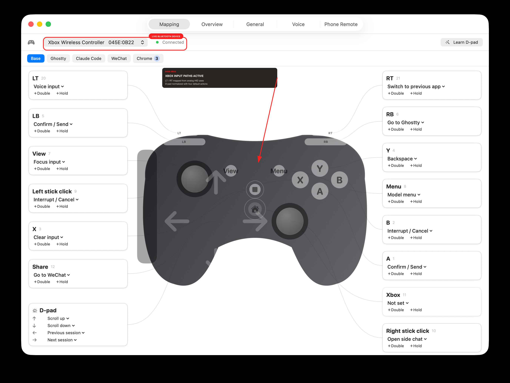

# Xbox controller proof

This is a physical-device smoke test, not a fixture. It was captured on
2026-08-21 from the signed `build/JoyCoding.app` on macOS 26.3 using the Xbox
Wireless Controller that was connected over Bluetooth at test time.

## Device identity

Both macOS Bluetooth inventory and a direct `IOHIDManager` probe reported one
physical gamepad:

```text
Xbox Wireless Controller
transport=Bluetooth Low Energy
vendor=0x045E product=0x0B22
virtual=no
```

The app then reported the same device ID, with the built-in Xbox profile seeded:

```json
{"deviceID":"045E:0B22","event":"device","mappedButtons":13,"mappedDirections":4,"name":"Xbox Wireless Controller","productID":2850,"vendorID":1118}
```

## Physical input to JoyCoding action

The trace was recorded with `JOYCODING_PROOF_DRY_RUN=1`. That flag suppresses
only the final `CGEvent` output so the smoke test cannot operate another app.
Device discovery, HID normalization, profile lookup, gesture handling, and
semantic action resolution all run through the production code path.

The following are consecutive stages from the captured JSONL trace (timestamps
omitted here for readability).

### A button

```json
{"usagePage":9,"usage":1,"value":1,"event":"rawInput"}
{"button":1,"down":true,"deviceID":"045E:0B22","event":"button"}
{"button":1,"action":"confirm","deviceID":"045E:0B22","event":"binding"}
{"action":"confirm","event":"action"}
```

### LT and RT analog triggers

LT is HID Simulation usage `0xC5` (197); RT is `0xC4` (196). They become virtual
buttons 20 and 21 with hysteresis. The 10% press threshold also works when an
Elite trigger stop limits travel.

```json
{"usagePage":2,"usage":197,"value":340,"logicalMax":1023,"event":"rawInput"}
{"button":20,"down":true,"deviceID":"045E:0B22","event":"button"}
{"button":20,"action":"ptt","deviceID":"045E:0B22","event":"binding"}
{"action":"pttStart","event":"action"}
{"usagePage":2,"usage":197,"value":40,"logicalMax":1023,"event":"rawInput"}
{"button":20,"down":false,"deviceID":"045E:0B22","event":"button"}
{"action":"pttStop","event":"action"}

{"usagePage":2,"usage":196,"value":284,"logicalMax":1023,"event":"rawInput"}
{"button":21,"down":true,"deviceID":"045E:0B22","event":"button"}
{"button":21,"action":"switchApp","deviceID":"045E:0B22","event":"binding"}
{"usagePage":2,"usage":196,"value":0,"logicalMax":1023,"event":"rawInput"}
{"button":21,"down":false,"deviceID":"045E:0B22","event":"button"}
{"action":"switchApp","event":"action"}
```

### Bluetooth D-pad

The controller declares a one-based hat range (`1...8`) and reports `0` when
centred. JoyCoding now normalizes it to its existing zero-based clockwise form.

```json
{"usagePage":1,"usage":57,"value":1,"logicalMin":1,"logicalMax":8,"event":"rawInput"}
{"direction":0,"channel":"hat","deviceID":"045E:0B22","event":"hat"}
{"action":"scrollUp","event":"action"}

{"usagePage":1,"usage":57,"value":5,"logicalMin":1,"logicalMax":8,"event":"rawInput"}
{"direction":4,"channel":"hat","deviceID":"045E:0B22","event":"hat"}
{"action":"scrollDown","event":"action"}

{"usagePage":1,"usage":57,"value":7,"logicalMin":1,"logicalMax":8,"event":"rawInput"}
{"direction":6,"channel":"hat","deviceID":"045E:0B22","event":"hat"}
{"action":"sessionPrev","event":"action"}
```

## Live app screenshot

The raw capture and annotation have identical dimensions (`2704 x 2032`). The
annotation is a separate SVG/Sharp overlay; the raw app pixels were not edited.



- [Raw PNG](images/proof/xbox-045e-0b22-connected-raw.png) — SHA-256
  `272a4cf4480431156205dab3cdb8abcd3ee5609c85e50bccf654a7ef543c6031`
- Annotated JPEG — SHA-256
  `d8088d368558edca81aee9e2ae9d9a01b129371a844c05d67621f7739cb5cfa4`

## Reproduce

```bash
swift test
./build.sh --no-notarize

swiftc -O tools/hidprobe/main.swift -framework IOKit -o .build/hidprobe
.build/hidprobe 15

JOYCODING_CONFIG_DIR="$PWD/.build/proof-config" \
JOYCODING_PROOF_LOG="$PWD/.build/xbox-proof.jsonl" \
JOYCODING_PROOF_DRY_RUN=1 \
build/JoyCoding.app/Contents/MacOS/JoyCoding --settings
```

Press A, LT, RT, and each D-pad direction while the final command is running,
then inspect `.build/xbox-proof.jsonl` for the same `rawInput -> button/hat ->
binding -> action` chain shown above.
